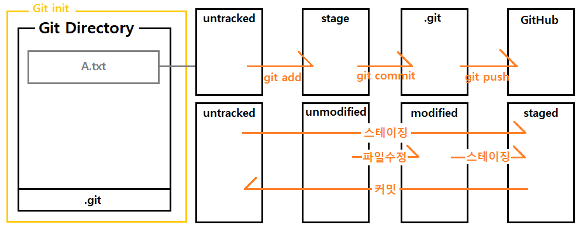

# Git Basic

<br>

## 1. Git 개요
Git 은 `분산 버전 관리 시스템 (DVCS)` 로 크게 버전관리, 백업, 협업을 할 수 있는 기능을 제공해준다.

<br>

- 버전관리
문서를 수정할 때 언제, 어디를 수정하였는지 구체적으로 기록할 수 있게 해준다.

- 백업
유실될 수 있는 자료를 클라우드와 같은 원격 저장소에 저장할 수 있게 해준다.

- 협업
원격저장소를 사용하여 여러사람들과 온라인으로 협업할 수 있게 해준다.


## 2. Git 주요 명령어

<br>

#### 1. Git 저장소 생성 및 초기화
특정 디렉토리의 파일들을 Git 에 의해 버전관리 될 수 있게 해주며 이 디렉토리를 
`작업 디렉토리 (working directory)` 또는 `작업 트리 (working tree)` 라고 부른다.
이 명령어를 사용하면 디렉토리안에 .git 이라는 숨겨진 디렉토리가 생생된다.
```shell 
$ git init 
```

<br>

#### 2. 스테이징
작업 디렉토리안의 파일들은 기본적으로 git 에 의해 관리되지않는 `untracked` 상태이기 때문에 
명령어를 통해 파일들이 git 에게 관리될 수 있도록 해준다.
이 명령어가 적용된 파일은 스테이지 (Stage) 라는 가상의 공간에 등록되며 git 에게 커밋대기 상태임을 알려준다.
```shell 
$ git add 파일명
```

<br>

#### 3. 상태확인
워킹디렉토리안의 파일들이 관리되고있는지, 커밋대기상태인지 와 같은 현재상태를 알려준다.
```shell 
$ git status 
```

<br>

#### 4. 커밋
스테이지에 등록되어있는 파일들을 버전으로 저장하며 커밋 내용에는 어떤 변화가 있었는지 기록한다.
커밋된 파일들은 git 에 의해 `tracked` 상태가 된다.
```shell 
$ git commit -m '커밋 내용'
```
`--amend` 를 사용하면 가장최근의 커밋 메시지를 수정할 수 있다.
```shell 
$ git commit --amend
```

<br>

#### 5. 스테이징 + 커밋
한번이라도 커밋된 파일이라면 스테이징과 커밋을 한번에 할 수 있다.
```shell 
$ git commit -am '커밋내용'
```

<br>

#### 6. 커밋 기록 확인
커밋을 통해 생성된 버전들을 볼 수 있다.
```shell 
$ git log
```
`--stat` 옵션을 추가하면 커밋에 관련된 파일들을 함께 보여준다.
```shell
$ git log --stat
```

<br>

#### 7. 수정 되돌리기
스테이징하기 전 수정한 내용을 가장최신버전으로 되돌린다.
```shell 
$ git checkout -- 파일명
```
아래의 명령도 된다.
```shell
$ git restore 파일명
```

<br>

#### 8. 스테이징 취소
스테이징한 파일을 스테이지에서 내린다.
```shell 
$ git reset HEAD 파일명
```
아래의 명령도 된다.
```shell
$ git restore --staged 파일명
```

<br>

#### 9. 커밋 취소
가장 마지막으로한 커밋을 취소한다.
스테이징도 자동으로 취소되며 `modified` 상태로 돌아간다.
```shell 
$ git reset HEAD^
```

<br>

#### 10. 특정 버전으로 변경
여러버전들중 특정 버전으로 커밋을 되돌린다.
입력한 버전이 가장 최신의 커밋이되고 해당 버전이후에 커밋된 버전들은 삭제된다.
```shell 
$ git reset --hard 커밋해쉬
```
위의 명령처럼 커밋을 삭제하지않고 변경이력을 취소한뒤 새로운 커밋을 생성한다.
```shell 
$ git revert 변경이력을 취소할 커밋해쉬
```

<br>

#### 111. 변경 사항 확인
워킹 디렉토리에있는 파일과 스테이지에 등록된 파일을 비교하거나
스테이지에 있는 파일과 저장소에 있는 파일을 비교하여 변경 사항을 확인할 수 있다.
```shell 
$ git diff
```

<br>

## 3. Git 상태
Git 의 워킹디렉토리에는 크게 `tracked` 와 `untracked` 상태가 있다.
파일이 생성된뒤 한번도 `git add` 또는 `git commit` 명령어를 사용하지않았다면 
해당파일은 `untracked` 상태가 되어 git 에게 관리되지않는다.
한번이라도 커밋된적이 있는 파일은 `tracked` 상태이기때문에 `unmodified`, `modified`, `staged` 중 하나의 상태를 가지게된다.
커밋된후 한번도 수정되지않았다면 `unmodified` 상태, 수정되었다면 `modified` 상태가 되는데
`modified` 상태가 되면 `git add` 명령을 통해 스테이지에 다시 등록해주어야 한다.

